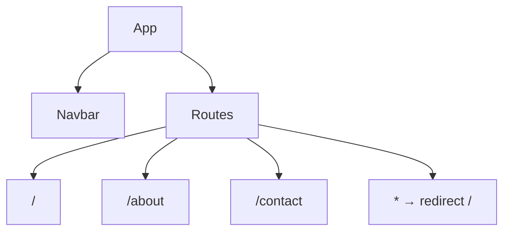

# Design Document: React Router App

## Overview

A minimal React SPA using React Router v6 for client-side routing. Three pages (Home, About, Contact) are rendered within a shared layout that includes a persistent navigation bar. The Contact page uses controlled form inputs via `useState`.

## Architecture

Single-page app with a root `App` component that defines routes. A `Navbar` component is rendered outside the route outlet so it persists across all pages.



## Components and Interfaces

- `App` — sets up `BrowserRouter`, `Navbar`, and `Routes`
- `Navbar` — renders `NavLink` elements for each route
- `Home` — renders a welcome message
- `About` — renders a brief app description
- `Contact` — controlled form with name, email, message fields

## Data Models

Contact form state (local to `Contact` component):

```ts
{
  name: string;
  email: string;
  message: string;
}
```

No external data store. State lives entirely in `Contact` via `useState`.

## Correctness Properties

*A property is a characteristic or behavior that should hold true across all valid executions of a system-essentially, a formal statement about what the system should do. Properties serve as the bridge between human-readable specifications and machine-verifiable correctness guarantees.*

Property 1: Controlled input binding
*For any* sequence of characters typed into a Contact form field, the displayed value of that field should always equal the current value of its corresponding state variable.
**Validates: Requirements 4.2**

Property 2: Form reset after submission
*For any* non-empty form state, after a valid form submission, all form fields should equal empty strings.
**Validates: Requirements 4.4**

Property 3: Empty field validation blocks submission
*For any* combination of form fields where at least one field is an empty string, submitting the form should not log data and should display a validation message.
**Validates: Requirements 4.5**

## Error Handling

- Invalid routes redirect to `/` via a catch-all `<Route path="*">`.
- Empty field validation is handled inline within the Contact component before logging.

## Testing Strategy

### Unit Tests

- Render each page component and assert key content is present.
- Render `Navbar` and assert all three links exist.
- Simulate form submission with valid data and assert console output and field reset.
- Simulate form submission with missing fields and assert validation messages appear.

### Property-Based Tests

Using **fast-check** as the property-based testing library.

Each property-based test runs a minimum of 100 iterations.

Each test is tagged with the format: `**Feature: react-router-app, Property {N}: {property_text}**`

- **Property 1** — Generate arbitrary strings for each field, simulate typing, assert state matches input value.
- **Property 2** — Generate arbitrary valid form states, submit, assert all fields reset to `""`.
- **Property 3** — Generate form states with at least one empty field, attempt submit, assert no console log and validation message shown.
